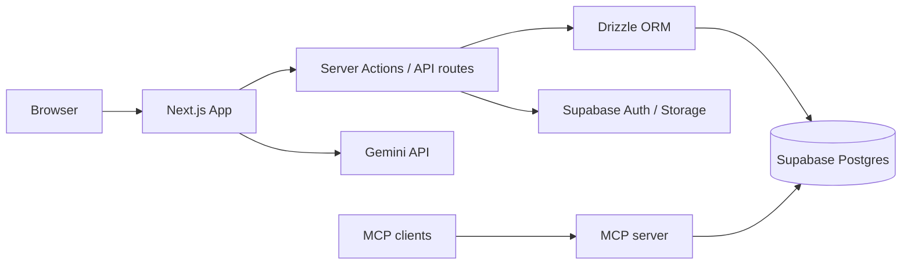

# Architecture

High-level overview of how Finance Buddy is built.

## Tech stack

| Layer | Technology |
|---|---|
| **Frontend** | Next.js 16 (App Router), React 19, Tailwind CSS 4, shadcn/ui |
| **Backend** | Next.js Server Actions, API routes |
| **Database** | Supabase Postgres with Row Level Security (RLS) |
| **ORM** | Drizzle ORM |
| **Auth** | Supabase Auth (email) |
| **Storage** | Supabase Storage (receipt images) |
| **AI** | Google Gemini via Vercel AI SDK |
| **Email** | Nodemailer (Gmail SMTP) |
| **Agent integration** | MCP server (`mcp/`) for external clients |

## Request flow

## App structure

The Next.js app uses **route groups** to separate concerns:

| Route group | Purpose |
|---|---|
| `(marketing)` | Public landing pages (about, contact, etc.) |
| `(auth)` | Login, signup, email verification |
| `(onboarding)` | First-time budget setup |
| `(app)` | Authenticated app (dashboard, expenses, reports, shared expenses) |

Shared code lives under `src/`:

- `actions/` — Server Actions for mutations (budgets, expenses, friends, etc.)
- `lib/` — Business logic, Supabase clients, finance helpers, AI tools
- `db/` — Drizzle schema and database client
- `components/` — UI components (app shell, charts, forms)
- `types/` — Shared TypeScript types

## Data & security

- **Postgres** is the source of truth. Schema changes go in `supabase/migrations/` and are mirrored in Drizzle (`drizzle/`, `src/db/schema.ts`).
- **RLS policies** enforce per-user data access at the database level.
- **Server-side only** secrets: `DATABASE_URL`, `SUPABASE_SECRET_KEY`, `GEMINI_API_KEY`, SMTP credentials.

## External services

| Service | Used for |
|---|---|
| Supabase | Auth, Postgres, Storage, RLS |
| Google Gemini | In-app AI assistant with tool calling |
| ExchangeRate-API | Live currency conversion |
| Gmail SMTP | Verification emails, friend requests, contact form |

## MCP server

A separate MCP package in `mcp/` exposes finance data and actions to Cursor and other agent clients over stdio or HTTP. See [MCP.md](./MCP.md) for details.
